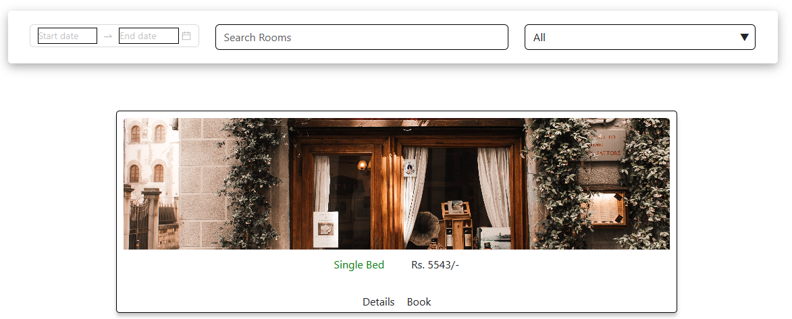
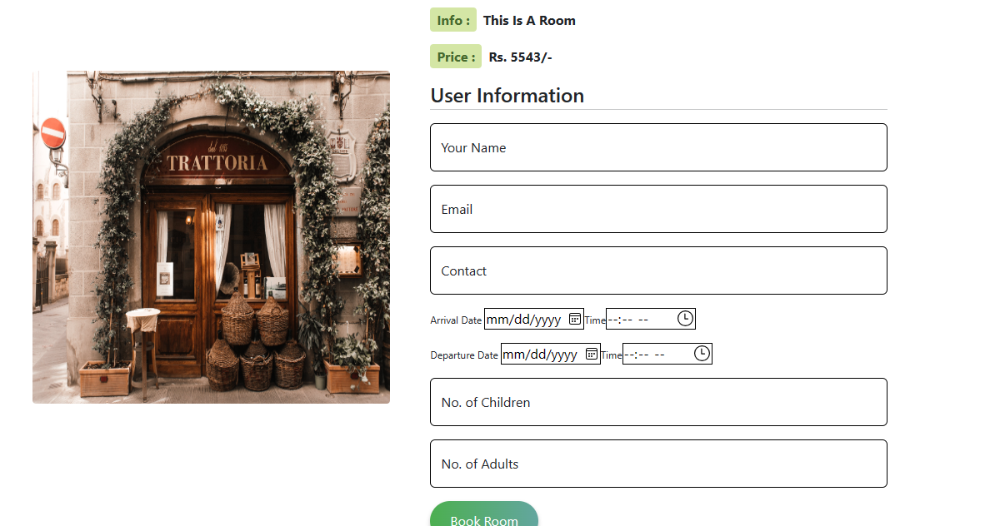

# Second-Monal-Hotel

This project is supervised as part of our CS-165 Software Engineering Theory course. This readme is to be taken as part of the User Manual.

## Accessing the Application

In the `Docs/Deployment Guidance - Starting the System on PC.pdf`, you can find the document to install the application. Follow that manual. Once you are done with that, you may be proceed with the usage of the application.

### Starting the Application

Hit the URL `http://localhost:3000/` and enter the following input: (fields are exactly named)

```json
{
	"username": "2021cs7@student.uet.edu.pk",
	"password": "myabc"
}
```

### Booking Screen

The Application provides a home screen to you. 



In this, we can see three filters, and a sample room. 

##### First Filter: Date

This is a date filter to filter all available rooms by date. If a room is not available at the required date, it will not be booked.

##### Second Filter: Room Name

This is a name filter to filter all available rooms by name.

##### Third Filter: Room Type

This is a name filter to filter all available rooms by name.


### Make a Booking With Bliss Adventure Hotels

When you select a room, you should see the likes of the following screen.



Enter your information for a seamless booking!